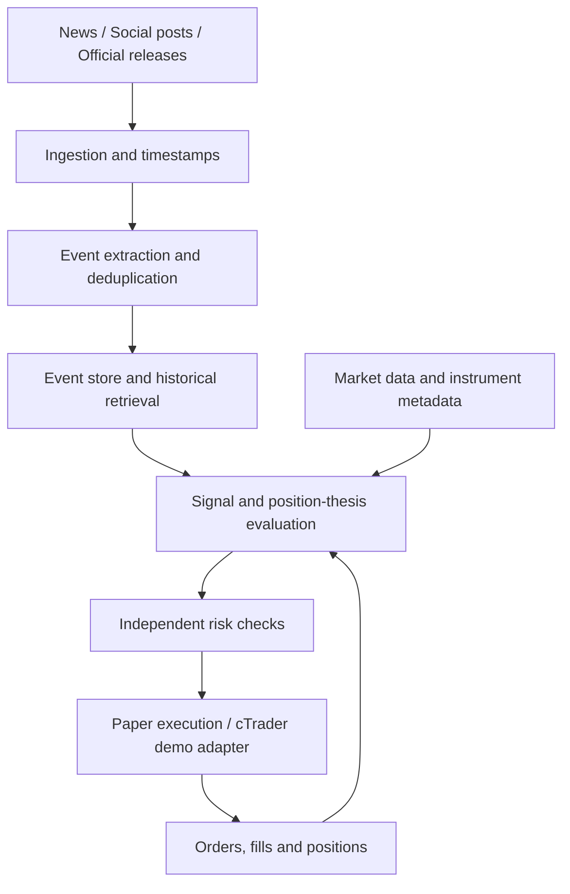

# EventLens

**Event-driven market research and trading automation for FX, gold, and oil.**

EventLens is a planned Python platform that turns news, influential social posts, and macroeconomic releases into structured events, evaluates their market implications, and tracks trading decisions as new information arrives.

**Status: planning and documentation only. No ingestion, models, backtests, or broker integration are implemented yet. No performance claims are made.**

## Core idea

A trading decision has a reason. EventLens aims to record that reason and continuously test whether new evidence supports, weakens, or invalidates it.

The intended workflow is:

1. Capture information from approved news feeds, social sources, and official releases.
2. Extract events, link entities, distinguish new information from repeats, and measure surprise where a valid expectation is available.
3. Retrieve historical analogues and evaluate the event alongside current market conditions.
4. Propose an action: abstain, open, hold, increase, reduce, or close a position.
5. Apply independent risk limits before submitting any order.
6. Reconcile fills and positions, monitor follow-up events, and reassess the original thesis.

## Initial scope

- **Markets:** FX currency pairs, gold, and oil; exact broker instruments will be verified during integration.
- **Information:** central-bank communications, macroeconomic releases, major geopolitical developments, and market-relevant posts by influential figures.
- **AI:** an existing LLM for language understanding, with replaceable providers. Numerical calculations, execution checks, and risk limits remain explicit code.
- **First broker target:** Pepperstone through cTrader Open API, initially using a demo account.
- **Validation:** historical event replay in Python, followed by real-time demo trading. Historical replay and broker demo trading are separate validation stages.

The first implementation will use fixtures and research/paper execution. Live trading is a later milestone requiring a separate decision. Training a foundation model from scratch is outside the initial scope.

## Proposed architecture

## Proposed technology stack

Python, Pydantic for validated event contracts, SQLAlchemy with SQLite for local research and PostgreSQL for deployed use, pandas/NumPy for event studies, and pytest for tests. A CLI will provide the first runnable interface. LLM and broker integrations will sit behind replaceable interfaces.

See [architecture](docs/architecture.md) and [roadmap](docs/roadmap.md) for the proposed boundaries and delivery stages. The directories described there are planned, not implemented packages.

## Research principles

- Preserve source publication time, first receipt time, revisions, provenance, and processing latency.
- Replay only information available at each decision time; account for possible historical knowledge in pretrained LLMs.
- Compare rule-only and LLM-assisted baselines with chronological evaluation.
- Include spread, fees, slippage assumptions, and relevant holding costs; demo fills do not establish live execution quality.
- Treat LLM confidence as an uncalibrated model output, not a probability of profit.
- Log decisions, supporting evidence, model versions, and reasons to abstain or exit.
- Keep credentials, account details, and restricted source datasets out of the public repository.

## Getting started

There is no runnable application yet. The next milestone is a reproducible fixture-driven research workflow, before connecting live information sources or a broker account.
