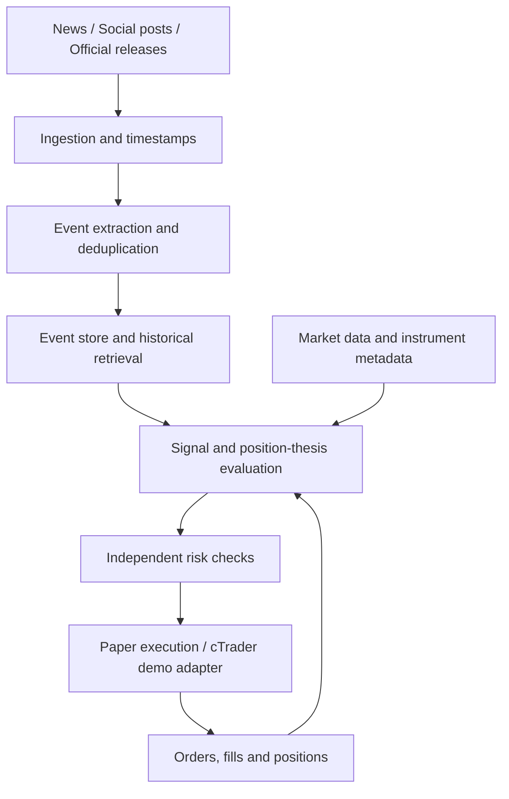

# EventLens

**Event-driven market research and trading automation for FX, gold, and oil.**

EventLens is a Python research project that turns news, influential social posts, and macroeconomic releases into structured events, evaluates their market implications, and tracks trading decisions as new information arrives.

**Status: v0.1 offline MVP. EUR/USD + FOMC synthetic replay runs locally. Live feeds, a network LLM provider, and cTrader integration are not connected. No performance claims are made.**

## Core idea

A trading decision has a reason. EventLens aims to record that reason and continuously test whether new evidence supports, weakens, or invalidates it.

The intended workflow is:

1. Capture information from approved news feeds, social sources, and official releases.
2. Extract events, link entities, distinguish new information from repeats, and measure surprise where a valid expectation is available.
3. Retrieve historical analogues and evaluate the event alongside current market conditions.
4. Propose an action: abstain, open, hold, increase, reduce, or close a position.
5. Apply independent risk limits before submitting any order.
6. Reconcile fills and positions, monitor follow-up events, and reassess the original thesis.

## Initial scope

- **First market and event:** EUR/USD + FOMC statements and follow-up information. USD/JPY, gold and oil are later extensions.
- **Information:** central-bank communications, macroeconomic releases, major geopolitical developments, and market-relevant posts by influential figures.
- **AI:** an existing LLM for language understanding, with replaceable providers. Numerical calculations, execution checks, and risk limits remain explicit code.
- **First broker target:** Pepperstone through cTrader Open API, initially using a demo account.
- **Validation:** historical event replay in Python, followed by real-time demo trading. Historical replay and broker demo trading are separate validation stages.

The first implementation uses synthetic fixtures and offline paper execution. Live trading is a later milestone requiring a separate decision. Training a foundation model from scratch is outside the initial scope.

## Architecture



## Technology stack

Python 3.11+, Pydantic for validated event contracts, SQLAlchemy with SQLite/PostgreSQL, and pytest for tests. The small descriptive event study uses the Python standard library. Ruff and mypy check code quality and types. The CLI is the first runnable interface; LLM and broker boundaries are replaceable.

See [architecture](docs/architecture.md) and [roadmap](docs/roadmap.md) for implemented boundaries, limitations and the remaining delivery stages.

## Research principles

- Preserve source publication time, first receipt time, revisions, provenance, and processing latency.
- Replay only information available at each decision time; account for possible historical knowledge in pretrained LLMs.
- Compare rule-only and LLM-assisted baselines with chronological evaluation.
- Include spread, fees, slippage assumptions, and relevant holding costs; demo fills do not establish live execution quality.
- Treat LLM confidence as an uncalibrated model output, not a probability of profit.
- Log decisions, supporting evidence, model versions, and reasons to abstain or exit.
- Keep credentials, account details, and restricted source datasets out of the public repository.

## Getting started

Run from the repository root (macOS/Linux):

```bash
python3 -m venv .venv
source .venv/bin/activate
python -m pip install -e '.[dev]'
eventlens demo
```

The command parses four invented FOMC messages, stores events in local SQLite, calculates descriptive 15-minute returns and prints an auditable paper replay with two closed trades. It requires no API key. Dates and prices are fictional; the output validates software behavior, not investment performance. Repeating the command inserts zero duplicate events.

```bash
eventlens schema
pytest -q
ruff check .
mypy packages/eventlens/src
```

For PostgreSQL, install `.[postgres]`, create a disposable research database, then supply its URL via `EVENTLENS_DATABASE_URL` using the `postgresql+psycopg://` scheme. Keep credentials outside the repository. Tests use `EVENTLENS_TEST_POSTGRES` for a separate disposable database; PostgreSQL tests skip locally when it is unset and run in GitHub CI.

`eventlens demo --help` lists custom source/quote files, modeled parsing latency and a JSON risk-config file. See [synthetic fixtures](examples/README.md). The LLM interface is tested with a fake client; it does not call a model by default.

## What this version proves

It demonstrates the source → event → decision → risk → paper position → follow-up exit lifecycle. Historical analogues are simple kind/stance matches. Rules do not measure market surprise, learn profitable behavior or perform general financial reasoning. Statement comparison, real data evaluation and cTrader demo are the next milestones.
