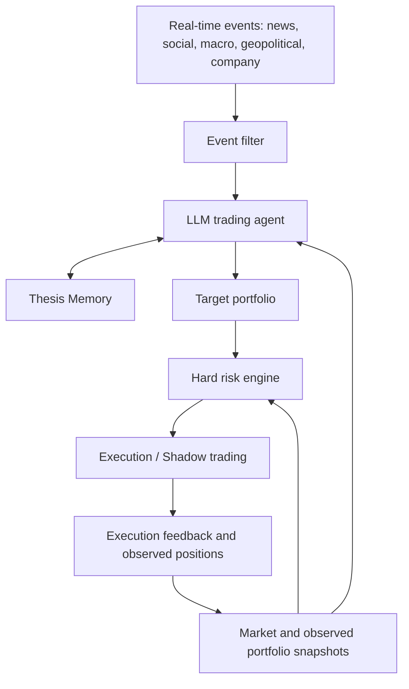

# EventLens

**Event → Thesis Memory → Position**

A foundation for a stateful, real-time event-driven trading agent powered by existing frontier LLM APIs. EventLens maintains persistent trading theses about ongoing situations, revises them as evidence changes, and expresses decisions as a target portfolio subject to deterministic risk limits.

**Status: durable Thesis Memory MVP (v0.3).** SQLite now stores raw evidence, immutable thesis revisions and decision history. A deterministic synthetic demo exercises creation, reinforcement, invalidation and restart recovery. There is no real LLM call, live event feed, portfolio execution, risk implementation or broker connection.

## The core idea

A new event is evidence in an ongoing story. It may support an existing thesis, contradict it, create a new one, or be irrelevant. The agent considers that evidence together with remembered theses, current market conditions and observed positions before proposing a new portfolio.

For example, an unconfirmed supply disruption might create a watch thesis with no position. A verified follow-up could strengthen the thesis and justify proposed exposure. A subsequent restoration of supply could invalidate it and lead to a proposed exit. These are illustrative reasoning transitions, not trading rules or performance claims.



## Responsibility boundaries

- **LLM trading agent:** interprets events, links evidence to theses, reasons about changing beliefs, and proposes portfolio decisions. It uses existing APIs such as GPT; no LLM training or RL is planned.
- **Thesis Memory:** a durable, versioned record of beliefs, supporting and contradicting evidence, invalidation conditions, review times and decision history. It is not just a chat transcript or a vector search index.
- **Target portfolio:** the desired signed exposure, distinct from current positions. Open, add, reduce, close, reverse and hedge are represented as changes in target exposure. Ignore/hold can leave the target unchanged.
- **Hard risk engine:** independent code that approves or rejects a proposal using operator-controlled limits and current account/market state. The LLM cannot edit limits or approve its own proposal.
- **Execution / shadow layer:** consumes only validated, current risk-approved targets. Recorded intentions are not fills; actual positions come from the shadow ledger or broker reconciliation.

This design intentionally lets the LLM reason about portfolio decisions. It does not require a separately trained return model between the agent and the risk gate. Those decisions will still need later research and shadow validation before any real execution.

## Repository structure

```text
eventlens/
├── README.md
├── pyproject.toml
├── docs/
│   └── architecture.md
├── src/eventlens/
│   ├── __init__.py
│   ├── contracts.py    # Events, theses, context, targets, risk and audit records
│   ├── events.py       # EventSource and EventFilter interfaces
│   ├── memory.py       # Durable ThesisMemory contract and revision conflicts
│   ├── sqlite_memory.py # Transactional SQLite implementation and history queries
│   ├── memory_cli.py    # Synthetic demo and inspection commands
│   ├── agent.py        # Provider-agnostic TradingAgent interface
│   ├── portfolio.py    # Observed state and target validation interfaces
│   ├── risk.py         # Deterministic HardRiskEngine interface
│   ├── execution.py    # Shadow-only execution interface
│   └── runtime.py      # Future orchestration and audit interfaces
├── tests/
│   ├── test_contracts.py
│   └── test_memory.py
└── .github/workflows/
    └── tests.yml
```

One Python package, clear module boundaries, no microservices. Pydantic is the only runtime dependency. Future source, LLM, storage and execution implementations must sit behind these interfaces.

## Thesis lifecycle

1. Persist the raw event and filter duplicates, unverifiable sources and irrelevant material.
2. Load committed thesis memory, observed positions, pending orders and current market data.
3. Ask the agent for evidence-linked thesis revisions and an optional target portfolio.
4. Validate the response and its references, then commit beliefs with optimistic concurrency checks.
5. If a target exists, validate it against current positions and independently evaluate hard risk.
6. Record approved shadow intent and subsequent execution feedback separately from beliefs.
7. Revisit active theses on new evidence and scheduled review, even if no position is held.

A rejected trade does not erase a valid thesis update. An agent failure does not create a default trade. Concurrent updates require a fresh decision; stale proposals are never blindly replayed.

## Run locally

From a fresh checkout, using Python 3.11+:

```bash
python3 -m venv .venv
source .venv/bin/activate
python -m pip install -e '.[dev]'
eventlens-memory demo
eventlens-memory history demo-supply
eventlens-memory event demo-event-2
eventlens-memory snapshot --as-of 2026-01-01T00:01:00Z
pytest -q
ruff check .
mypy src
```

The demo uses a simulated January 1, 2026 clock and invented supply events. It creates `data/memory-demo.sqlite` locally. Repeating the demo is idempotent. Use a dedicated demo database, never a production memory store. No positions or orders are created. Add `--verbose` before the subcommand for logs. `--database PATH` selects another local SQLite file. All runtime data remains outside Git. The old `eventlens demo` command, EUR/USD fixtures, rule-based signals, event study, backtester and database adapters have been removed. The previous implementation remains accessible in Git history.

## Implementation boundaries

Implemented: immutable typed contracts, UTC validation, transactional SQLite memory, revision/expiry/evidence checks, historical snapshots, query CLI and tests.

Defined but **not implemented**: semantic source filtering, provider adapters, real reasoning orchestration, portfolio reconciliation, risk limits and shadow fills. No model/provider or broker is hard-coded. No claims are made about event alpha, forecast accuracy or profitability.

The memory stage stops here for review. See [memory storage and acceptance](docs/memory.md). A future stage can connect a real LLM to propose thesis updates; this release uses only predetermined decisions and rejects non-null portfolio targets. There is no live trading path.

See [architecture and interface contracts](docs/architecture.md) for data semantics, concurrency, failure handling and future acceptance boundaries.
