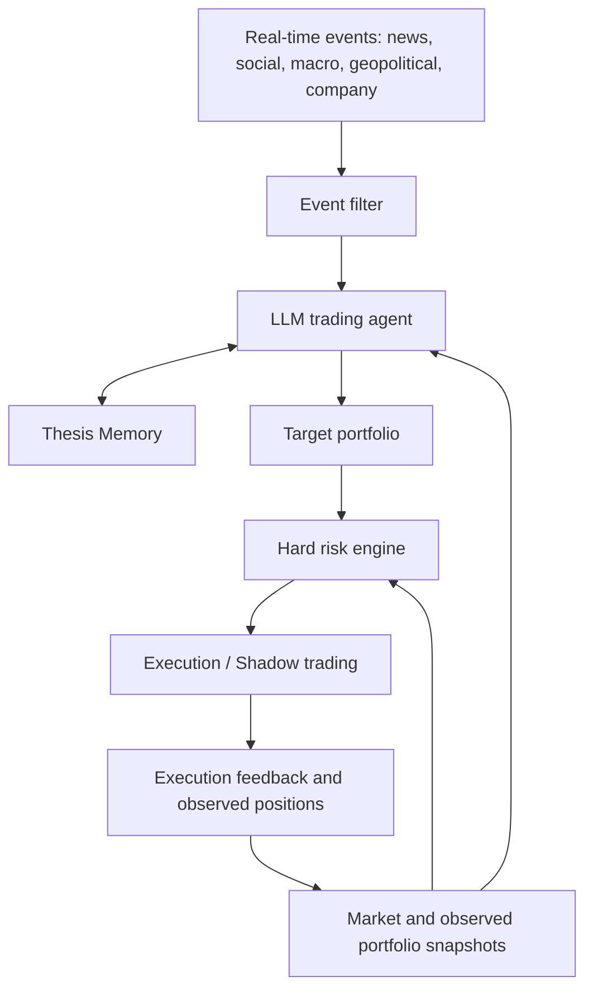

# EventLens

**Event → Thesis Memory → Position**

A foundation for a stateful, real-time event-driven trading agent powered by existing frontier LLM APIs. EventLens maintains persistent trading theses about ongoing situations, revises them as evidence changes, and expresses decisions as a target portfolio subject to deterministic risk limits.

**Status: official-source polling and memory-only LLM integration (v0.5).** SQLite stores event evidence, immutable thesis revisions and decision history. A Federal Reserve monetary-policy RSS watcher can discover new FOMC statements, validate source links, record publication/receipt times, and optionally send them to DeepSeek for thesis updates. Its first run baselines existing feed items without paid inference. Offline tests and manual real-source/API checks cover this path; CI makes no paid calls. DeepSeek currently maps the `deepseek-flash` API name to DeepSeek-V4.1-Flash ([provider model table](https://api-docs.deepseek.com/quick_start/pricing/)). There is no general news/social feed, portfolio execution, risk implementation or broker connection.

## The core idea

A new event is evidence in an ongoing story. It may support an existing thesis, contradict it, create a new one, or be irrelevant. The agent considers that evidence together with remembered theses, current market conditions and observed positions before proposing a new portfolio.

For example, an unconfirmed supply disruption might create a watch thesis with no position. A verified follow-up could strengthen the thesis and justify proposed exposure. A subsequent restoration of supply could invalidate it and lead to a proposed exit. These are illustrative reasoning transitions, not trading rules or performance claims.


```mermaid
flowchart TD
    A[Real-time events: news, social, macro, geopolitical, company] --> B[Event filter]
    B --> C[LLM trading agent]
    C <--> D[Thesis Memory]
    E[Market and observed portfolio snapshots] --> C
    C --> F[Target portfolio]
    F --> G[Hard risk engine]
    E --> G
    G --> H[Execution / Shadow trading]
    H --> I[Execution feedback and observed positions]
    I --> E
```

## Responsibility boundaries

- **LLM trading agent:** interprets events, links evidence to theses, reasons about changing beliefs, and proposes portfolio decisions. It uses existing APIs such as GPT; no LLM training or RL is planned.
- **Thesis Memory:** a durable, versioned record of beliefs, supporting and contradicting evidence, invalidation conditions, review times and decision history. It is not just a chat transcript or a vector search index.
- **Target portfolio:** the desired signed exposure, distinct from current positions. Open, add, reduce, close, reverse and hedge are represented as changes in target exposure. Ignore/hold can leave the target unchanged.
- **Hard risk engine:** independent code that approves or rejects a proposal using operator-controlled limits and current account/market state. The LLM cannot edit limits or approve its own proposal.
- **Execution / shadow layer:** consumes only validated, current risk-approved targets. Recorded intentions are not fills; actual positions come from the shadow ledger or broker reconciliation.

This design intentionally lets the LLM reason about portfolio decisions. It does not require a separately trained return model between the agent and the risk gate. Those decisions will still need later research and shadow validation before any real execution.

## Repository structure

```text
eventlens/
├── README.md
├── pyproject.toml
├── docs/
│   ├── architecture.md
│   ├── memory.md
│   ├── reasoning.md
│   ├── fed-intake.md
│   └── fomc-memory-case.md
├── src/eventlens/
│   ├── __init__.py
│   ├── contracts.py    # Events, theses, context, targets, risk and audit records
│   ├── events.py       # EventSource and EventFilter interfaces
│   ├── memory.py       # Durable ThesisMemory contract and revision conflicts
│   ├── sqlite_memory.py # Transactional SQLite implementation and history queries
│   ├── memory_cli.py    # Synthetic demo and inspection commands
│   ├── deepseek.py      # DeepSeek API adapter behind a JSON model interface
│   ├── reasoning.py     # Proposal validation and memory-only orchestration
│   ├── fed.py           # Official FOMC RSS intake, validation and durable inbox
│   ├── fed_cli.py       # One-shot or continuous polling command
│   ├── agent.py        # Provider-agnostic TradingAgent interface
│   ├── portfolio.py    # Observed state and target validation interfaces
│   ├── risk.py         # Deterministic HardRiskEngine interface
│   ├── execution.py    # Shadow-only execution interface
│   └── runtime.py      # Future orchestration and audit interfaces
├── tests/
│   ├── test_contracts.py
│   ├── test_memory.py
│   ├── test_reasoning.py
│   └── test_fed.py
└── .github/workflows/
    └── tests.yml
```

One Python package, clear module boundaries, no microservices. Pydantic and HTTPX are the runtime dependencies. The model client interface allows another API provider without changing memory storage.

## Thesis lifecycle

1. Persist the raw event. Semantic duplicate and source-authenticity filters are planned; this stage only rejects conflicting event IDs.
2. Load committed thesis memory, observed positions, pending orders and current market data.
3. Ask the agent for evidence-linked thesis revisions. This stage forbids target portfolios.
4. Validate the response and its references, then commit beliefs with optimistic concurrency checks.
5. If a target exists, validate it against current positions and independently evaluate hard risk.
6. Record approved shadow intent and subsequent execution feedback separately from beliefs.
7. Revisit active theses on new evidence and scheduled review, even if no position is held.

A rejected trade does not erase a valid thesis update. An agent failure does not create a default trade. Concurrent updates require a fresh decision; stale proposals are never blindly replayed.

## Run locally

From a fresh checkout, using Python 3.11+:

```bash
python3 -m venv .venv
source .venv/bin/activate
python -m pip install -e '.[dev]'
eventlens-memory demo
eventlens-memory history demo-supply
eventlens-memory event demo-event-2
eventlens-memory snapshot --as-of 2026-01-01T00:01:00Z
eventlens-fed --database data/fed.sqlite
pytest -q
ruff check .
mypy src
```

The demo uses a simulated January 1, 2026 clock and invented supply events. It creates `data/memory-demo.sqlite` locally. Repeating the demo is idempotent. Use a dedicated demo database, never a production memory store. No positions or orders are created. Add `--verbose` before the subcommand for logs. `--database PATH` selects another local SQLite file. All runtime data remains outside Git. The old `eventlens demo` command, EUR/USD fixtures, rule-based signals, event study, backtester and database adapters have been removed. The previous implementation remains accessible in Git history.

To try one real model call, create a **separate** local event JSON file matching `Event` in `contracts.py`, with a unique `event_id`, source URL/reference, actual source publication time, actual time received and source text. Use timezone-aware ISO 8601 timestamps. Then set `DEEPSEEK_API_KEY` in the shell that runs the CLI and call:

```bash
eventlens-memory --database data/research.sqlite reason path/to/event.json
eventlens-memory --database data/research.sqlite snapshot
```

Never put the key in JSON, a committed file or the command line. The `reason` command sends the event and current theses to DeepSeek and incurs API charges. Local event files remain manually supplied, unverified research input; the separate Fed watcher checks its official source allowlist. See [LLM reasoning and setup](docs/reasoning.md) for the exact contract and failure behavior.

The Fed watcher provides the first automatic source. Run `eventlens-fed --database data/fed.sqlite` once to baseline the current official feed without an API call, then repeat it to inspect newly collected raw events. To opt in to model reasoning, set `DEEPSEEK_API_KEY` and add `--reason`; `--watch --interval 60` keeps polling. On the Mac used for this project, the key can be read from Keychain without placing it in the command history:

```bash
DEEPSEEK_API_KEY="$(security find-generic-password -s eventlens-deepseek -a "$USER" -w)" eventlens-fed --database data/fed.sqlite --reason --watch --interval 60
```

See [Fed intake and acceptance](docs/fed-intake.md) for bootstrap, failure and timestamp semantics. Polling RSS is for research intake; it does not guarantee subsecond availability.

## Implementation boundaries

Implemented: immutable typed contracts, UTC validation, transactional SQLite memory, revision/expiry/evidence checks, historical snapshots, a provider-neutral JSON client interface, DeepSeek adapter, memory-only proposal validation, official Fed polling adapter, durable collector inbox, CLIs and tests.

Defined but **not implemented**: semantic deduplication across different URLs/sources, independent fact-checking, non-Fed collectors, portfolio reasoning, portfolio reconciliation, risk limits and shadow fills. No broker is hard-coded. No claims are made about event alpha, forecast accuracy or profitability.

The LLM stage stops at memory updates for review. See [memory storage and acceptance](docs/memory.md). The deterministic demo still uses predetermined decisions; the optional `reason` command invokes DeepSeek. All non-null portfolio targets remain rejected. There is no live trading path.

See [architecture and interface contracts](docs/architecture.md) for data semantics, concurrency, failure handling and future acceptance boundaries.

The [FOMC memory case study](docs/fomc-memory-case.md) records a two-event DeepSeek run against official September and November 2024 statements. It demonstrates one thesis created and later revised, with historical source times kept separate from the 2026 replay receipt times. It is not a return study or a backtest.
