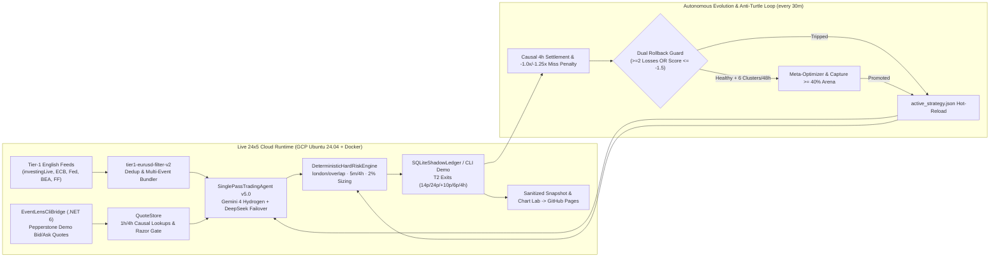

<p align="center">
  
</p>

<p align="center">
  <a href="https://github.com/lohis-aimbot/eventlens/actions/workflows/tests.yml"></a>
  
  
  <a href="https://lohis-aimbot.github.io/eventlens/dashboard/"></a>
  <a href="https://colab.research.google.com/github/lohis-aimbot/eventlens/blob/main/notebooks/stage_a_quant_reward_lab.ipynb"></a>
  
  
</p>

<p align="center">
  <strong>English</strong> | <a href="README_CN.md">简体中文</a> &nbsp;·&nbsp;
  <a href="https://lohis-aimbot.github.io/eventlens/dashboard/"><strong>Live Web Dashboard ↗</strong></a> &nbsp;·&nbsp;
  <a href="docs/blueprint-v2.md">Blueprint v2</a> &nbsp;·&nbsp;
  <a href="https://lohis-aimbot.github.io/eventlens/">Visual Overview ↗</a>
</p>

<p align="center">
  <a href="#1-introduction">Introduction</a> ·
  <a href="#2-system-architecture--safety-boundaries">Architecture</a> ·
  <a href="#3-empirical-evaluation--live-telemetry">Empirical Evaluation</a> ·
  <a href="#4-next-phase-research-blueprint-v2">Blueprint v2</a> ·
  <a href="#5-live-bilingual-web-dashboard">Web Dashboard</a> ·
  <a href="#6-quickstart--reproducible-verification">Quickstart</a> ·
  <a href="#7-repository-map--documentation">Repository</a>
</p>

---

## News & Research Log

- **`[2026/11/27]`** Shipped the **Auto-Evolution & Anti-Turtle Reward Engine** (`src/eventlens/evolution.py`, `eventlens-shadow evolve-tick`, `eventlens-evolution.timer`): settles matured `4h` events every `30m` using strict anti-turtle penalties (`alpha_miss = 1.0x`, `1.25x` on missed `T3 >= 25p` moves, `+0.05` idle avoid cap), enforces a `>= 40%` qualified opportunity capture veto, runs a `6`-cluster / `48h` Meta-Optimizer Arena that hot-reloads `active_strategy.json` within hard bounds, protects Demo capital via a **dual-trigger auto-rollback circuit breaker** (`2` consecutive stop-losses / `-2.0R` live OR `<= -1.5` matured anti-turtle reward score), and exposes the live **Auto-Evolution Scoreboard** in `docs/dashboard/index.html`.
- **`[2026/11/26]`** Released & deployed **Strategy v5** (`single-pass-agent-v5.0`): added `GeminiClient` (`gemini-4-hydrogen`, `thinkingLevel="low"`) + `DeepSeekClient` automatic failover (`src/eventlens/gemini.py`), `london`/`overlap` entry gating, causal `1h/4h` HTF & `5m` anti-chase hard guardrails, `T2_mid_swing` protection (`14p SL / 24p TP / +10p->6p trailing / 4h`), daily NY rollover reset for `"market-state-watch"` (`trading_day_window`), and pure event-driven breakout reviews. Lifted `--kill-switch` on `eventlens-demo-01` for controlled Demo forward validation.
- **`[2026/11/25]`** Shipped **Stage A Workbench & Deliverables 1–3** per **[Commander Blueprint v2](docs/blueprint-v2.md)** ([中文版](docs/blueprint-v2_CN.md)): read-only `eventlens-shadow export-research` (`src/eventlens/research_lab.py`) syncing 14+ day real cloud tick/news telemetry (`chart-lab.json`), interactive **Tab 3 `Chart Lab`** in the Web Dashboard, and the **[Google Colab Quant & Reward Lab](https://colab.research.google.com/github/lohis-aimbot/eventlens/blob/main/notebooks/stage_a_quant_reward_lab.ipynb)** notebook.
- **`[2026/11/24]`** Completed forensic autopsy of the Nov 11–24 Pepperstone Demo run (`6 trades, 0W/6L, -11.62 USD`). Activated `--kill-switch` on the GCP VM to halt unvalidated Demo entries while continuing uninterrupted `24×5` quote & macro feed capture.
- **`[2026/11/19]`** Released `single-pass-agent-v4.1`, `tier1-eurusd-filter-v2` (cutting daily LLM evaluations from `80/day` to `~24–27/day`), tighter `8.0p/6.0p` trailing profit locks, NY pre-close entry cutoffs, and a redesigned main-screen Web Dashboard with inline CoT reasoning drawers.
- **`[2026/11/11]`** Built headless `.NET 6` `EventLensCliBridge.algo` on Ubuntu 24.04 (`cTrader.Automate 1.0.21`), passed disconnected metadata checks, `demo-reconcile`, and bounded `1,000 EUR` Pepperstone Demo `demo-smoke`, entering `24×5` cloud observation.

---

## 1. Introduction

**EventLens** is a neuro-symbolic, empirical intraday macro trading & research system focused on **EUR/USD**, organized around one auditable pipeline:

> **Macro Event (Arrival-Clocked) → Persistent Thesis Memory → Deterministic Risk Gate → Shadow / Demo Execution**

Instead of treating an LLM as an unconstrained black-box trader, EventLens enforces a strict architectural separation between **semantic reasoning** and **deterministic execution safety**:

- **Zero Credential Custody:** The LLM (`Gemini 4 Hydrogen` primary with automatic `DeepSeek` failover via `FailoverModelClient`) only receives structured context and outputs bounded JSON proposals—it never touches broker keys or raw order endpoints.
- **Deterministic Risk & Exit Authority:** Pure Python guards (`DeterministicHardRiskEngine`) govern `london`/`overlap` session gates, `5m` anti-chase / `4h` HTF counter-trend blocks, `q`-scaled risk budgets (`<= 2%`), daily loss caps (`8 USD`), `--kill-switch` enforcement, and model-free `T2_mid_swing` SL/TP/trailing/timeout exits.
- **Anti-Lookahead Data Integrity:** Every Tier-1 headline and broker tick preserves distinct `source_at`, `published_at`, `received_at`, and `available_at` UTC clocks in SQLite, preventing inadvertent future-information leakage during replay or evaluation.
- **Anti-Turtle Auto-Evolution:** Matured events settle causally with full `1.0x–1.25x` missed-opportunity penalties; every `6` matured clusters or `48h` candidate profiles compete under a `>= 40%` capture-rate veto and dual-trigger auto-rollback (`2` losses or `<= -1.5` reward score).

---

## 2. System Architecture & Safety Boundaries


```mermaid
flowchart LR
    subgraph LiveRuntime["Live 24x5 Cloud Runtime (GCP Ubuntu 24.04 + Docker)"]
        News["Tier-1 English Feeds<br/>(investingLive, ECB, Fed, BEA, FF)"] --> Filter["tier1-eurusd-filter-v2<br/>Dedup & Multi-Event Bundler"]
        Bridge["EventLensCliBridge (.NET 6)<br/>Pepperstone Demo Bid/Ask Quotes"] --> Quotes["QuoteStore<br/>1h/4h Causal Lookups & Razor Gate"]
        Filter --> Agent["SinglePassTradingAgent v5.0<br/>Gemini 4 Hydrogen + DeepSeek Failover"]
        Quotes --> Agent
        Agent --> Risk["DeterministicHardRiskEngine<br/>london/overlap · 5m/4h · 2% Sizing"]
        Risk --> Ledger["SQLiteShadowLedger / CLI Demo<br/>T2 Exits (14p/24p/+10p/6p/4h)"]
        Ledger --> Dash["Sanitized Snapshot & Chart Lab -> GitHub Pages"]
    end

    subgraph AutoEvo["Autonomous Evolution & Anti-Turtle Loop (every 30m)"]
        Ledger --> Settle["Causal 4h Settlement & -1.0x/-1.25x Miss Penalty"]
        Settle --> Guard{"Dual Rollback Guard<br/>(>=2 Losses OR Score <= -1.5)"}
        Guard -- "Healthy + 6 Clusters/48h" --> Arena["Meta-Optimizer & Capture >= 40% Arena"]
        Guard -- "Tripped" --> Hot["Rollback & Blacklist Hash"]
        Arena -- "Promoted" --> Hot["active_strategy.json Hot-Reload"]
        Hot --> Agent
        Hot --> Risk
    end
```

### Subsystem Breakdown

| Layer | Canonical Modules | Implemented Responsibilities & Safeguards |
|---|---|---|
| **Information Intake** | `src/eventlens/sources/english_tier1.py`, `src/eventlens/observer.py`, `src/eventlens/latency.py` | Captures Tier-1 English macro feeds; `tier1-eurusd-filter-v2` drops session roundups, option expiries, and non-G2 noise; tracks 4D feed health and strict arrival clocks without fabricating missing release timestamps |
| **LLM & Failover Memory** | `src/eventlens/gemini.py`, `src/eventlens/deepseek.py`, `src/eventlens/trading/agent.py`, `src/eventlens/memory.py`, `src/eventlens/sqlite_memory.py` | Runs `GeminiClient` (`gemini-4-hydrogen`, `thinkingLevel="low"`) with automatic `DeepSeekClient` failover (`FailoverModelClient`), `single-pass-agent-v5.0` structured JSON proposals, and hot-reloadable dynamic prompt rules |
| **Quotes & HTF Metrics** | `src/eventlens/quotes.py`, `src/eventlens/sources/ctrader_demo.py`, `ctrader/EventLensCliBridge/` | Streams `12h`-rotated Pepperstone Demo EUR/USD ticks; computes DST-aware FX sessions, `O(log N)` causal `1h`/`4h` lookups, and `UsdPerOneLot` / `UsdPerMillionUsdVolume` Razor commission accounting |
| **Hard Risk & T2 Exits** | `src/eventlens/trading/risk.py`, `src/eventlens/trading/portfolio.py`, `src/eventlens/trading/execution.py`, `src/eventlens/trading/ctrader_cli_broker.py` | Enforces `london`/`overlap` entry gating, `5m` chase & `4h` counter-trend blocks, `2%` risk sizing, `8 USD` daily loss guard, `ClosingDealId` Demo verification, `!Account.IsLive` hard block, and `T2_mid_swing` (`14/24/+10/6/4h`) exits |
| **Auto-Evolution Engine** | `src/eventlens/evolution.py`, `src/eventlens/research_lab.py` | Runs every `30m` via `eventlens-evolution.timer`: `4h` causal settlement with strict anti-turtle penalties (`1.0x`, `1.25x` T3), `>= 40%` capture gate, `6`-cluster/`48h` Meta-Optimizer Arena, `active_strategy.json` hot-reload, and dual-trigger auto-rollback |
| **Runtime & Web UI** | `src/eventlens/runtime.py`, `src/eventlens/shadow_cli.py`, `src/eventlens/dashboard.py`, `docs/dashboard/index.html` | Single-process `ShadowRunner` with NY daily watch-review reset, read-only SQLite diagnostics, `Chart Lab`, and live Auto-Evolution Scoreboard synchronization |

---

## 3. Empirical Evaluation & Live Telemetry

EventLens treats **unfiltered forward telemetry** as first-class scientific evidence—both what succeeded in engineering and what failed in strategy expectancy.

### Nov 11 – Nov 24, 2026 Live Pepperstone Demo Autopsy (`200 USD / 200x` Razor)

- **Cumulative Result:** Equity moved from **`176.10 USD` → `164.48 USD`** (`-6.6%`, `24.48 USD` above the `140 USD` hard floor); **`6` trades (`0W / 6L`, `0%` win rate)**; net PnL **`-11.62 USD`** (gross `-10.90 USD`, commissions `0.72 USD`), avg `-9.1 pips`.
- **Pre-Filter Noise Reduction (`v4.1`):** Cut daily LLM calls from **`80/day`** (hitting budget cap) down to **`~24–27/day`** (blocking 48 non-G2/single-stock headlines, 37 rapid revisions, 19 empty deltas, and 17 wraps).

| Date | Ver | Side | Trigger & Session | Net Pips / Exit | MFE / MAE | 1h / 4h / 12h Drift | Empirical Root Cause |
|---|---|---|---|---|---|---|---|
| `11-13` | `v3.2` | Short | Fed Collins | `-6.7p` (`15m` exit) | `+0.2p` / `-8.3p` | `-5.7p / +1.8p / +5.4p` | Chased `30m` `-20.3p` local floor |
| `11-18` | `v4.0` | Short | European news wrap | `-14.0p` (`14p` SL) | `+6.1p` / `-13.9p` | `-13.1p / -2.8p / -14.5p` | Session-wrap noise |
| `11-19` | `v4.0` | Short | FOMC Minutes | `-3.7p` (NY cutoff) | **`+8.5p`** / `-6.6p` | `+5.5p / -2.1p / +0.9p` | `22p` trailing trigger too wide |
| `11-19` | `v4.0` | Short | NYT Iran strikes (`03:11Z` Asian) | `-14.0p` (`14p` SL) | `+1.0p` / `-13.7p` | `-4.4p / -15.4p / -32.3p` | Asian chase reversed on London open |
| `11-19` | `v4.0` | Long | Philly Fed (`6.3` vs `20.0`) | `-14.1p` (`14p` SL) | **`+8.5p`** / `-13.7p` | `+4.0p / -15.6p / -26.2p` | Tier-2 spike faded vs USD trend |
| `11-24` | `v4.1` | Short | Fed Williams (`23:09Z` Asian) | `-2.0p` (`5h` exit) | `+3.9p` / `-13.0p` | `+1.3p / -2.5p / +4.6p` | Illiquid Asian session |

### Three Scientific & Engineering Takeaways

1. **Payoff-Structure Mismatch:** Maximum Favorable Excursion across all 6 trades stayed inside `[+0.2p, +8.5p]` (zero reached `+10p`), showing `14p SL / 42p TP` brackets were misaligned with actual intraday macro follow-through when lacking `1H/4H/Daily` trend alignment and liquidity-session gating.
2. **Discovered Singleton `thesis_id` Deadlock:** `max_reviews_per_thesis = 3` (`src/eventlens/runtime.py:181,3607`, wired at `src/eventlens/shadow_cli.py:1672`) counts lifetime reviews per `thesis_id`. Because `v4` mapped all watches onto singleton `MARKET_STATE_WATCH_THESIS_ID = "market-state-watch"` (`src/eventlens/trading/agent.py:35`), `step_reviews()` froze after Nov 16—leaving **42 `v4.1` pullback `watch_condition`s** unreviewed (`0` triggers). Held intentionally for bundled deployment after Stage A validation.
3. **Disciplined Risk Halt:** Rather than overfitting live stops on a 6-trade sample, `--kill-switch` was engaged on Nov 24 while keeping `24×5` tick (`~377 MB`) and Tier-1 news (`~2.45 GB`) collection online.

### Epistemic Boundary Matrix

| Verification Tier | Current Evidence |
|---|---|
| **Offline-Verified** | **`168` automated tests** (`pytest -q`), strict `mypy src` (`24 source files`), `ruff check .`, and `ruff format --check .` covering Gemini 4 failover, Strategy v5 risk gates, Auto-Evolution settlement, dual rollback, anti-turtle capture veto, and `research_lab` exports |
| **Live-Observed** | Ubuntu 24.04 GCP `gemini-4-hydrogen` live connectivity, `demo-reconcile`, bounded `demo-smoke`, continuous `24×5` EUR/USD tick & Tier-1 macro SQLite accumulation (`Nov 11–present`), and Strategy v5 forward Demo execution |
| **Autonomous Evolution** | Cloud `eventlens-evolution.timer` (`30m` settlement, `-1.0x / -1.25x` T3 miss penalties, `>= 40%` capture veto, `6`-cluster/`48h` Meta-Optimizer Arena, `active_strategy.json` hot-reload, and `2`-loss / `-1.5` score rollback guard) |
| **Hard-Blocked** | Real-money Live broker endpoints and accounts (`!Account.IsLive` enforced in code & execution bridge) |

---

## 4. Next-Phase Research Blueprint (v2)

| Stage | Core Design & Methodology | Gate / Artifact |
|---|---|---|
| **Stage 0 · Safety Halt** | Activate `--kill-switch` while running `24×5` quote (`live-quotes.sqlite`) and news (`observer.sqlite`) streams | Active (`0` open Demo positions) |
| **Stage 1 · Two-Phase Ladder** | **Phase A:** Empirical discovery & reward benchmark on 14+ day real cloud data; **Phase B:** Scale to 2–5Y macro bars & decouple LLM semantic factors from a Walk-Forward ML/reward policy (`60% / 20% / 20%`) | Phase B unlocked only after positive Phase A out-of-sample alpha |
| **Stage 2 · Dual Labeling & Attribution** | Algorithmic 3-tier markers (`90m >= 10p`, `4h >= 15p`, `8h >= 25p`) + human `Buy/Sell/Avoid` tags; **4 FX sessions**; bidirectional **`-60m` pre-arrival** (front-running/lag) + **`0–15m / 15–60m` post-arrival** news attribution | `Chart Lab` JSON + Colab dataset |
| **Stage 3 · Net-R Reward & Exits** | Standardized net `R` after spread & Razor fees with `>70%` drawdown penalty, miss/avoid shaping, **4 exit templates** (`10/15p`, `14/24p+trail`, `18/36p`, `ATR`) + `30m/1h/4h` drift, evaluated on a **`70% / 30%` OOS split** | Reproducible Colab Reward Lab |
| **Stage 4 · Strategy v5 & Auto-Evolution** | Stage A OOS win by `gemini-4-hydrogen` -> shipped **Strategy v5** (`v5.0`, `london/overlap`, `T2`, daily review reset), lifted `--kill-switch`, and activated 30m **Auto-Evolution Engine** | Live on `eventlens-demo-01` |

Full technical specification → **[docs/blueprint-v2.md](docs/blueprint-v2.md)**

---

## 5. Live Bilingual Web Dashboard

Monitor live equity, open/closed Demo positions, triggering news catalysts, full model Chain-of-Thought (`CoT`) reasoning, and decision audit logs directly from the browser:

- **Hosted Live Dashboard & Chart Lab:** **[https://lohis-aimbot.github.io/eventlens/dashboard/](https://lohis-aimbot.github.io/eventlens/dashboard/)**
- **Stage A Colab Quant & Reward Lab:** **[Open in Google Colab ↗](https://colab.research.google.com/github/lohis-aimbot/eventlens/blob/main/notebooks/stage_a_quant_reward_lab.ipynb)** (`notebooks/stage_a_quant_reward_lab.ipynb`)
- **Project Visual Overview:** **[https://lohis-aimbot.github.io/eventlens/](https://lohis-aimbot.github.io/eventlens/)**
- **Capabilities:** Main-screen trade ledger (`#mainTradesSection`), clickable open position hero card, inline 3-tab CoT inspection drawer, daily FX PnL curves, **interactive Tab 3 `Chart Lab`** (`M5/M15/H1`, 3-tier algo overlays, manual `Buy/Sell/Avoid` labeling with JSON export, and `±60m` bidirectional news attribution), bilingual **`中文 / EN`** toggle, Light/Dark themes, and mobile **PWA** install.

---

## 6. Quickstart & Reproducible Verification

Requires **Python 3.11+**. All CI verification steps run locally with **no broker credentials or LLM API keys**:

```bash
git clone https://github.com/lohis-aimbot/eventlens.git
cd eventlens

python3 -m venv .venv
source .venv/bin/activate
python -m pip install -e '.[dev]'

# Run full quality & test gate (CI parity: 168 tests)
ruff check .
ruff format --check .
mypy src
pytest -q
python -m build
```

### Primary CLI (`eventlens-shadow`)

```bash
# Inspect all runtime subcommands and risk/strategy options
eventlens-shadow --help
eventlens-shadow start --help

# Export sanitized 14+ day K-line, 3-tier labels & ±60m attributed news bundle for Colab / Chart Lab
eventlens-shadow export-research --output-dir ./research-bundle

# Run one Auto-Evolution settlement, dual-trigger rollback & 6-cluster arena check
eventlens-shadow evolve-tick --no-call-model

# Launch the local read-only Web Dashboard (with live Chart Lab, Auto-Evolution & /api/chart-lab)
eventlens-shadow dashboard
```

| Subcommand | Role |
|---|---|
| `start` / `stop` / `recover` | Run the single-process intraday Shadow / opt-in Demo loop (with `--active-strategy` hot-reload), drain cleanly on `SIGTERM`, or reconcile crash state |
| `evolve-tick` | Settle matured `4h` events with anti-turtle miss penalties (`1.0x / 1.25x`), enforce dual rollback (`>= 2` losses or `<= -1.5` reward score), and run the `6`-cluster / `48h` Meta-Optimizer Arena |
| `status` / `report` | Open SQLite databases strictly read-only (`?mode=ro`) to audit equity, decisions, latency, and events |
| `demo-reconcile` / `demo-smoke` / `demo-unlock` | Reconcile `EventLensCliBridge` Demo state, run bounded `1,000–2,000 EUR` smoke verification, or unlock ambiguous states |
| `export-research` | Export strictly sanitized `chart-lab.json`, `bars_m1.csv.gz`, `M5/M15/H1` CSVs, 3-tier setups, and counterfactual `events.json` |
| `export-dashboard` / `dashboard` | Export sanitized static snapshots (`dashboard-live`) or serve the local read-only dashboard + `/api/chart-lab` |

Headless `24×5` Linux provisioning & Docker `.NET 6` bridge runbook → **[docs/cloud-24x5-deployment.md](docs/cloud-24x5-deployment.md)**

---

## 7. Repository Map & Documentation

<details>
<summary><strong>Repository structure (verified 24 source files &amp; deployment tree)</strong></summary>

```text
eventlens/
├── src/eventlens/
│   ├── contracts.py                 Immutable Pydantic schemas & strict UTC clock checks
│   ├── observer.py                  Tier-1 macro capture, revisions & 4D stream health
│   ├── latency.py                   Clock-lag decomposition utilities
│   ├── quotes.py                    QuoteStore, DST FX sessions, 1h/4h lookups & Razor policy
│   ├── memory.py / sqlite_memory.py Durable SQLite evidence & immutable thesis revisions
│   ├── gemini.py / deepseek.py      Gemini 4 (thinkingLevel) primary & DeepSeek failover JSON clients
│   ├── evolution.py                 Auto-Evolution Engine, anti-turtle arena, hot-reload & dual rollback
│   ├── runtime.py                   IntradayEventRuntime, daily watch-review reset & ShadowRunner
│   ├── shadow_cli.py                eventlens-shadow CLI entrypoint (`start`, `evolve-tick`, etc.)
│   ├── dashboard.py                 Sanitized dashboard & Auto-Evolution exporter + local server
│   ├── research_lab.py              Read-only Stage A exporter, 3-tier MFE/MAE, ±60m & anti-turtle Net-R
│   ├── sources/
│   │   ├── english_tier1.py         investingLive, ECB, Fed, BEA, FF & tier1-eurusd-filter-v2
│   │   ├── ctrader_demo.py          Containerized Demo quote tailer & bridge handshake
│   │   └── events.py                Source & filter contracts
│   └── trading/
│       ├── agent.py                 SinglePassTradingAgent (single-pass-agent-v5.0 + hot-reload prompt)
│       ├── portfolio.py             Target sizing & q-dependent risk budgets
│       ├── risk.py                  DeterministicHardRiskEngine (session, 5m/4h HTF, --kill-switch)
│       ├── execution.py             SQLiteShadowLedger & model-free T2 pip SL/TP/trailing
│       └── ctrader_cli_broker.py    ClosingDealId-verified CLI Demo execution (!Account.IsLive)
├── ctrader/EventLensCliBridge/      .NET 6 cBot (cTrader.Automate 1.0.21) + packages.lock.json
├── deploy/gcp/                      Ubuntu 24.04 setup, Docker compose, watchdog, evolution timer & units
├── docs/
│   ├── blueprint-v2.md / _CN.md     Signed-off Commander Blueprint v2 (Stages 0-4)
│   ├── dashboard/                   Live bilingual PWA Web Dashboard, Evolution Scoreboard & Chart Lab
│   └── research/                    Preflight audits, overnight audits & historical FOMC studies
├── configs/ & notebooks/            Stage A Colab Quant & Reward Lab + diagnostic notebooks
└── tests/                           168 unit, protocol, integration, cloud-audit & auto-evolution tests
```
</details>

### Documentation Index

| Document | Focus |
|---|---|
| **[Commander Blueprint v2 (EN / 中文)](docs/blueprint-v2.md)** | Nov 11–24 live Demo autopsy, Stage A/B roadmap, `Net-R` reward math, exit templates & Chart Lab spec |
| **[Architecture & Module Map](docs/architecture.md)** | Subsystem responsibilities and neuro-symbolic boundaries |
| **[Cloud 24×5 Deployment](docs/cloud-24x5-deployment.md)** | Ubuntu 24.04 `systemd` + Docker `EventLensCliBridge` provisioning and Demo acceptance gates |
| **[Observer & Live Quotes](docs/observer.md)** | Arrival-clock taxonomy, 4D stream health ([acceptance](docs/observer-acceptance.md)), and [quote cost policy](docs/live-quotes.md) |
| **[Memory & Reasoning Setup](docs/memory.md)** | Thesis lifecycle and [safe credential management](docs/reasoning.md) |
| **[Shadow Acceptance & Audits](docs/shadow-acceptance.md)** | Early live Shadow observations, [Nov 4 audit](docs/research/overnight-20261104-shadow-audit-and-prompt-draft.md), and [Nov 11 cloud preflight](docs/research/2026-11-11-cloud-preflight-audit.md) |
| **[Historical Roadmap](docs/roadmap.md)** | Original Stage 0–5 milestones linking to Blueprint v2 |

---

> [!IMPORTANT]
> **Research Boundary & Disclaimer:** EventLens is built strictly for quantitative systems research and educational demonstration. Real-money Live broker endpoints and accounts are permanently hard-blocked in code (`!Account.IsLive`). Cloud execution runs exclusively on an isolated Pepperstone Demo account guarded by `2%` max per-trade risk, an `8 USD` daily loss cap, and the dual-trigger Auto-Evolution rollback circuit breaker; past Demo or offline observations do **not** guarantee future trading profitability.
